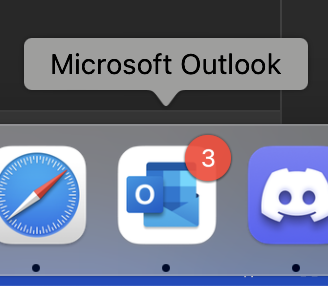
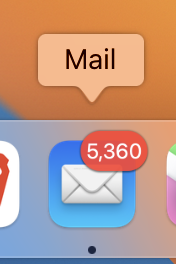
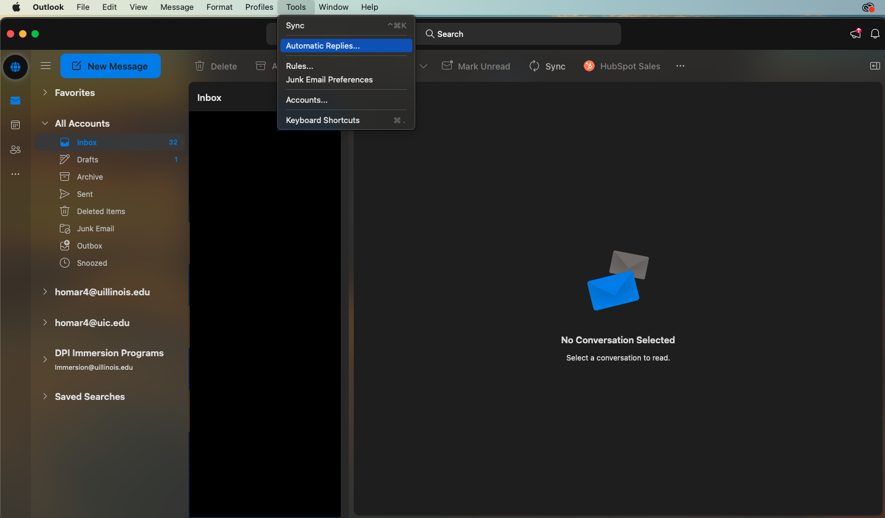
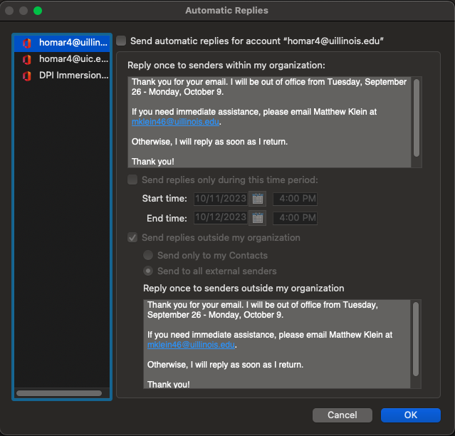
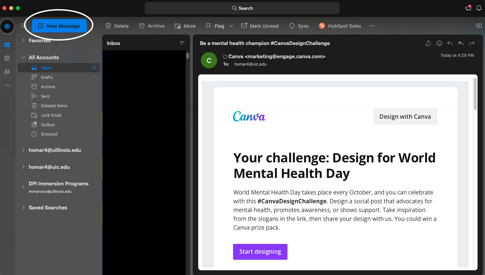
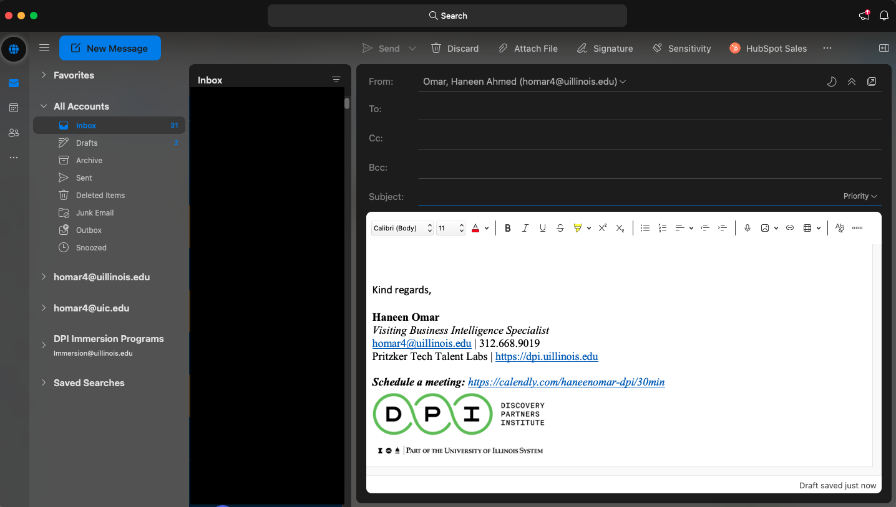
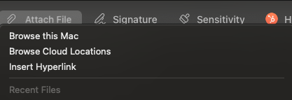

# Setup your email 📧
In this lesson, you will learn how to set up, manage, and write email effectively. This includes setting up your email on different platforms with notifications enabled to stay on top of important communications.

## Email Management

### Why Email Management is Important
Email is crucial for professional communication. Checking it frequently is essential for timely responses and effective communication. Proper email management enhances productivity, prevents missing important messages, and maintains a professional image.

### Set Up Your Email

#### Choose an Email Client

- **Desktop Clients**: Examples include [Microsoft Outlook](https://www.microsoft.com/en-us/microsoft-365/outlook/email-and-calendar-software-microsoft-outlook), [Apple Mail](https://apps.apple.com/us/app/mail/id1108187098), and [Thunderbird](https://www.thunderbird.net/en-US/). For DPI, **we recommend using Outlook**.

 

- **Web Clients**: Common examples include [outlook.office.com](outlook.office.com), [mail.google.com](mail.google.com) and [mail.yahoo.com](mail.yahoo.com). This is dependent on whichever email service you are using.
- **Mobile Clients**: Most smartphones come with built-in email apps. You can also download third-party apps like [Gmail](https://apps.apple.com/us/app/gmail-email-by-google/id422689480), [Outlook](https://apps.apple.com/us/app/microsoft-outlook/id951937596), or [Spark](https://apps.apple.com/us/app/spark-mail-ai-email-inbox/id997102246).

#### Add Your Email Account
- Navigate to the account setup section (usually found in settings or preferences).
- Enter your email address and password.
- Follow the on-screen instructions to complete the setup.

#### Configure Notifications
- Ensure notifications are enabled for new emails.
  - For Outlook on MacOS, you may need to allow notifications: go to `System Settings` > `Notifications` > `Microsoft Outlook` and toggle `Allow notifications`.
- Customize notification settings to avoid unnecessary distractions (e.g., only notify for important emails).

#### Organize Your Inbox
- Use folders or labels to categorize emails.
- Set up filters or rules to automatically sort incoming mail.
- Archive or delete emails you no longer need to keep your inbox tidy.

#### Check Your Email Frequently
- Set specific times during the day to check and respond to emails.
- Enable push notifications on your phone for immediate alerts.

#### Out of Office Automatic Replies
- Set up automatic replies when you are away from work. In the toolbar, navigate to `Tools` > `Automatic Replies...`.

- Choose `Send automatic replies`, write your automatic message and set the start and end times. Make sure your message includes a greeting, the date you will be out of office, and the person to contact instead.

- If you work with people outside of your organization, make sure to tick the box for `Send replies outside my organization`. You will need to copy/paste your automatic message.

## Writing Effective Emails

### Sending an Email
- In Outlook, click on `New Message` to compose a new message.

- Fill in the recipient's email address in the `To` field. You can fill in the `Cc` (carbon copy) field for people who need to be informed but are not the primary recipient, and the `Bcc` (blind carbon copy) field for recipients who should receive the email but remain hidden from others. `Bcc` is also useful for sending mass emails without revealing recipients' email addresses.

- Write a descriptive subject line that summarizes the email's content. Write a clear and concise message in the body of the email. Remember to sign off with a professional closing.
- If you have any attachment, click on the paperclip icon to attach files.

- Once you are ready, press `Send` to send the email.

### Tips for Writing Effective Emails

- General Tone and Style
  - Keep your tone professional.
  - Consider your email's tone.
  - Be careful with humor.
  - Resist emojis in email.
- Subject Line and Content
  - Avoid vague subject lines – keep subject lines descriptive and short.
  - Introduce yourself.
  - Structure the email properly.
  - Call out attachments.
- Grammar and Punctuation
  - Use proper email punctuation.
  - Practice good grammar.
  - Use sentence case.
- Formatting and Appearance
  - Always use standard fonts and formatting.
  - Perfect your email signature.
  - Don't add that 'Sent from my phone' caveat.
  - Shorten your URLs.
- Salutations and Sign-offs
  - Choose your email salutation carefully.
  - Leave the right impression with your email sign-off.
- Recipient and Replies
  - Triple-check your recipient's name.
  - Fill out your email fields properly.
  - Use Bcc appropriately.
  - Use 'Reply all' sparingly.
  - Think before forwarding.
  - Respond in a timely manner.
  - Set informative out-of-office replies.
- Follow-up and Responsiveness
  - Reply to all your emails.

### Example Emails

#### Bad Example

> Howdy Morgan,
>
> My name is Haneen and I started at DPI last week. Are you free this afternoon to meet? I would love to get to know the team better! ❤️
>
> See ya!
>
> Haneen

#### Good Example

> Hello Morgan,
>
> My name is Haneen Omar and I am the new Business Intelligence Specialist with the Corporate Partnerships team here at DPI. I’m so excited to be part of the team! I would love to set up a quick 1:1 meeting to get to know you and share a bit about myself. 
> Thank you and I look forward to meeting! 
>
> Kind regards, 
>
> Haneen Omar

#### Better Example

> Hello Morgan,
>
> My name is Haneen Omar and I am the new Business Intelligence Specialist with the Corporate Partnerships team here at DPI. I’m so excited to be part of the team! I would love to set up a quick 1:1 meeting to get to know you and share a bit about myself. 
>
> Please let me know if any of the following days and times work for you:
> - Friday, September 29th: 1pm-1:30pm
> - Monday, October 2nd: 10am-10:30am; 1pm-1:30pm
>
> Thank you and I look forward to meeting! 
>
> Kind regards, 
>
> Haneen Omar

## Quiz

- Why is it important to set up an email client on multiple devices?
- It makes it easier to monitor incoming emails.
  - Correct! Monitoring emails across devices ensures you don't miss important communications.
- It is required by most companies.
  - Not quite. While not always required, it's a best practice for staying organized.
- It improves the battery life of your devices.
  - Not correct. Setting up email on multiple devices does not impact battery life.
{: .choose_best #importance title="Importance of Setting Up Email" points="1" answer="1"}

- What should you do to ensure you receive important emails promptly?
- Check your email once a week.
  - Not correct. Checking emails frequently is essential for timely responses.
- Enable notifications for new emails.
  - Correct! Notifications help you stay informed about new messages.
- Use only one email client.
  - Not correct. Using multiple clients can enhance accessibility.
- Check your email every morning.
  - Correct! Checking your email is a great way to start the day.
{: .choose_all #notifications title="Email Notifications" points="1" answer="[2,4]"}

- Organizing your inbox with folders and labels can help keep your email more manageable.
- True
  - Correct! Organizing your inbox can help you stay on top of important messages.
- False
  - Not correct. Organization is key to effective email management.
{: .choose_best #organization title="Inbox Organization" points="1" answer="1"}

- Have you setup your desktop email client with your student email?
- Yes
  - Great! Make sure notifications are enabled and to check frequently.
- No
  - Please setup your desktop email client
{: .choose_best #desktop title="Setup desktop client" points="1" answer="1"}

- Have you setup your mobile email client with your student email?
- Yes
  - Great! Make sure notifications are enabled and to check frequently.
- No
  - Please setup your mobile email client on your phone
{: .choose_best #mobile title="Setup mobile client" points="1" answer="1"}

## Follow Up Assignment
Send an email to a TA with the subject line: "Set up my email". This will confirm that you have successfully set up your email client.
